New Shipment and Shipping Label
===============================

* `Creating a new shipment`_
* `Generate Shipping Label`_

.. _Creating a new shipment:

Creating A new Shipment
------------------------

1. Go to ``Inventory & Stock`` and select ``Customer Shipments``. Click on
   ``Create a new record``.

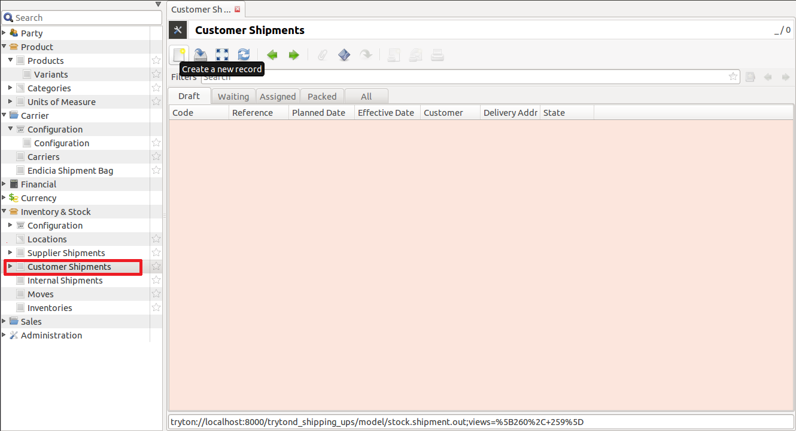

2. Under Customer Shipments, fill in all the fields.

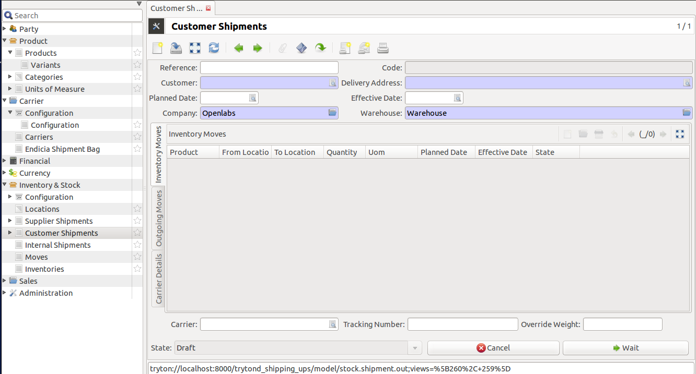

These are:

* **Reference**: A reference number.
* **Code**: Unique code given to identify the shipment.
* **Customer**: Customer for whom the shipment is created.
* **Delivery Address**: Address to where the the shipment will be delivered.
* **Planned Date**: Date when Shipment will be assigned.
* **Effective Date**: Date when shipment will be dispatched.
* **Company**: Seller of the product.
* **Warehouse**: Storage location from where the outgoing moves will occur.
* **Carrier**: The shipment carriers available, it this case it would be UPS.
* **Tracking Number**: Unique tracking number of the shipment. This can be
  generated when shipment is packed and ready for dispatch.
* **Override Weight**: Weight which will be overrided.

Fill in the details. In the Outgoing Moves Tab, click on ``Create a new 
record``. Alternatively, press <F3> to create a new record. 

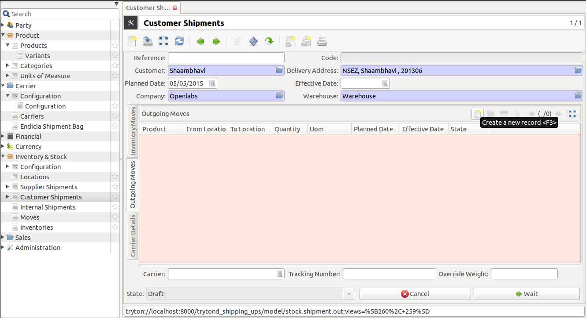

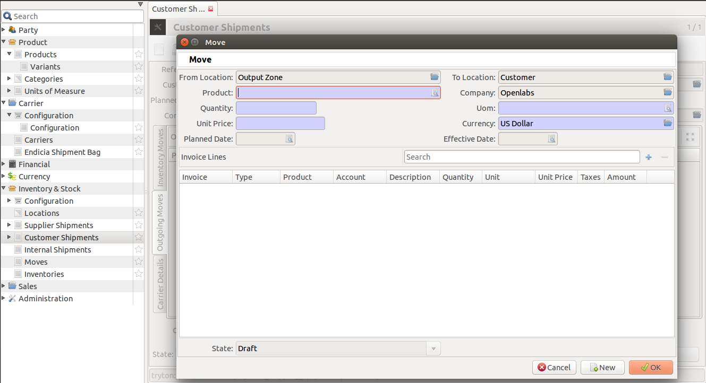

The following fields are present in the Outgoing Moves Tab:

* **From Location**: Location of the storage warehouse.
* **To Location**: Location of the delivery address.
* **Product**: Name of Product
* **Company**: Name of Seller
* **Quantity**: Quantity of the single product.
* **UOM**: Unit of Measurement. The magnitude of physical quantity
  of prodcuct purchased.
* **Unit Price**: Price of a single unit.
* **Currency**: Currency to be used in billing. This can be 
  different, based on currency systems of different countries.
* **Planned Date**: Date when shipment will be assigned.
* **Effective Date**: Date of dispatch of shipment.
* **Invoice Lines**: Invoice Details of the product.

3. Add details of Shipping and Product, and click on ``Wait``. The shipment 
   remains on waiting state if the item is not available in inventory.

.. figure:: images/27.png

4. Click on ``Assign``. The shipment gets assigned when the items are 
   available. This gives you a warning, if one of the item is not 
   available. The item can either be “Force Assigned”, or removed 
   for a partial shipment.

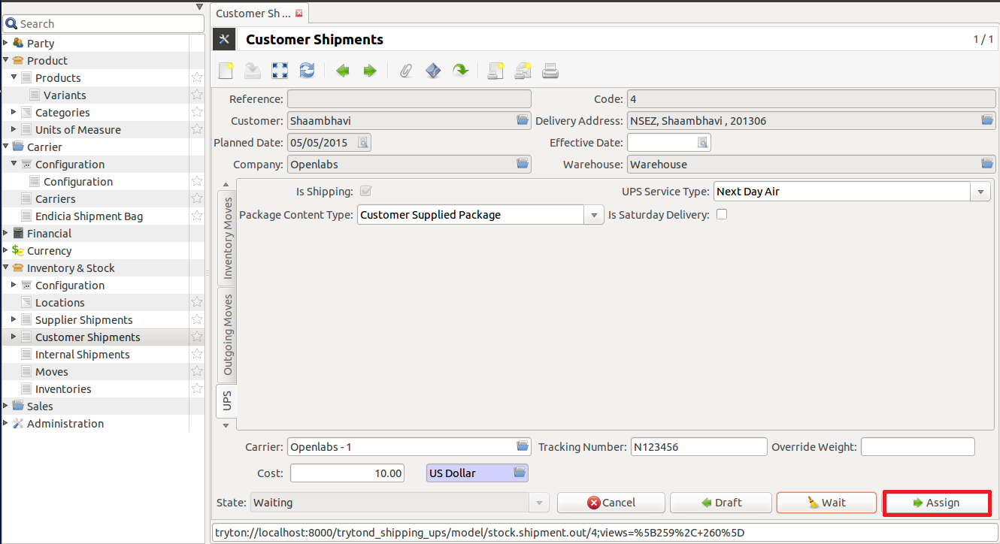

.. note::
 
   Only warehouse managers can force assign a shipment line, 
   if there is a mismatch in counting and the items is 
   available in the warehouse.

5. Another tab UPS appears.

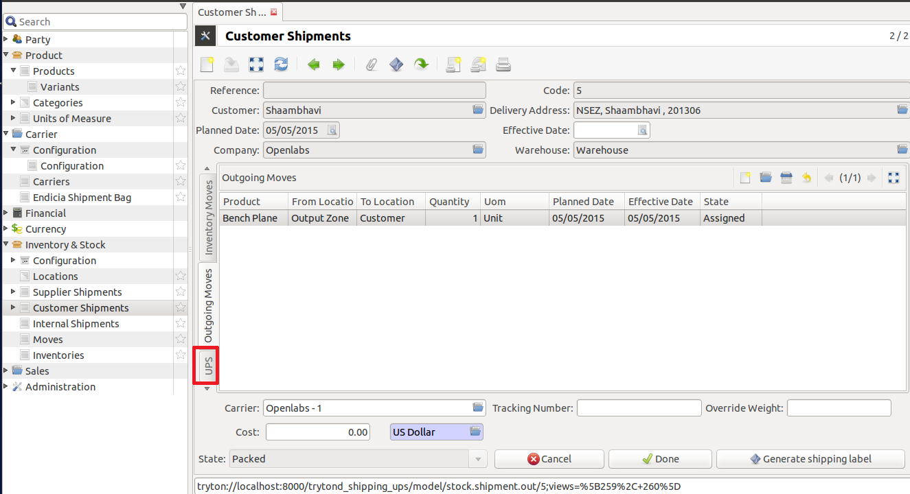

6. Complete the UPS Details.

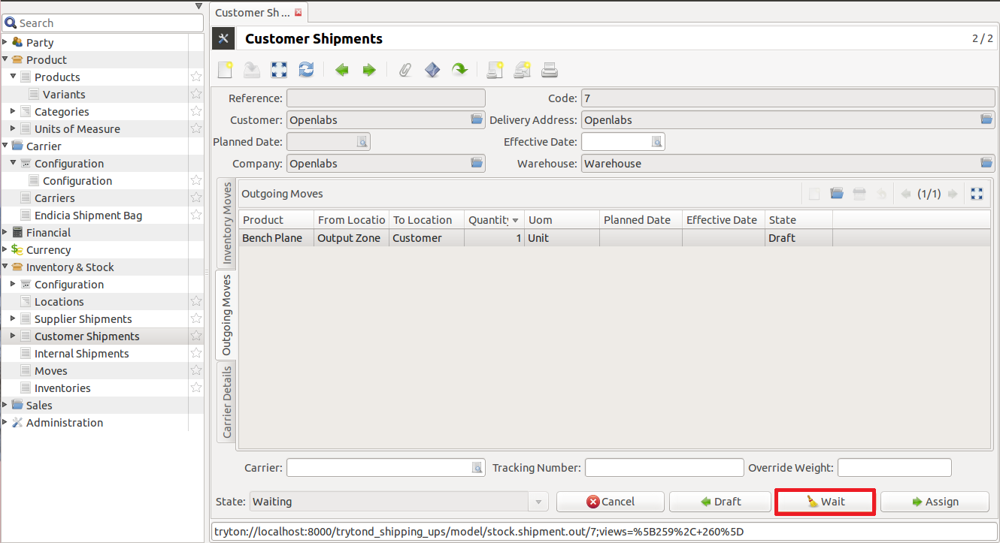
   
The following fields need to be filled:

* **Is Shipping**: This is checked by default. 
* **UPS Service Type**: You can select the carrier service type from the 
  drop-down menu.
* **Package Content Type**: From the drop-down, you can select the package
  shape.
* **Is Saturday Devlivery**: Can be checked if true.

7. Click on ``Assign``. 

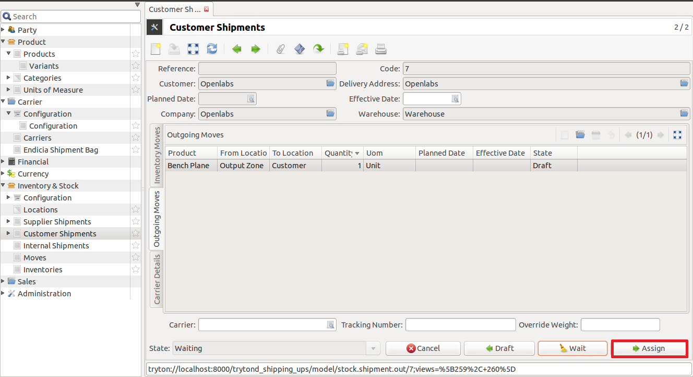

8. Once the items are assigned, they are ready to be packed and shipped. 
   “Packing list” report can be generated (Go to the report and 
   click Packing List) and get all the products to be shipped. Once all 
   the items are found and packed, click ``Done``. 
   Now the shipment is in Packed State. Before hitting "Done", the shipping
   label is generated. This label is then pasted on the package and sent
   out for delivery.

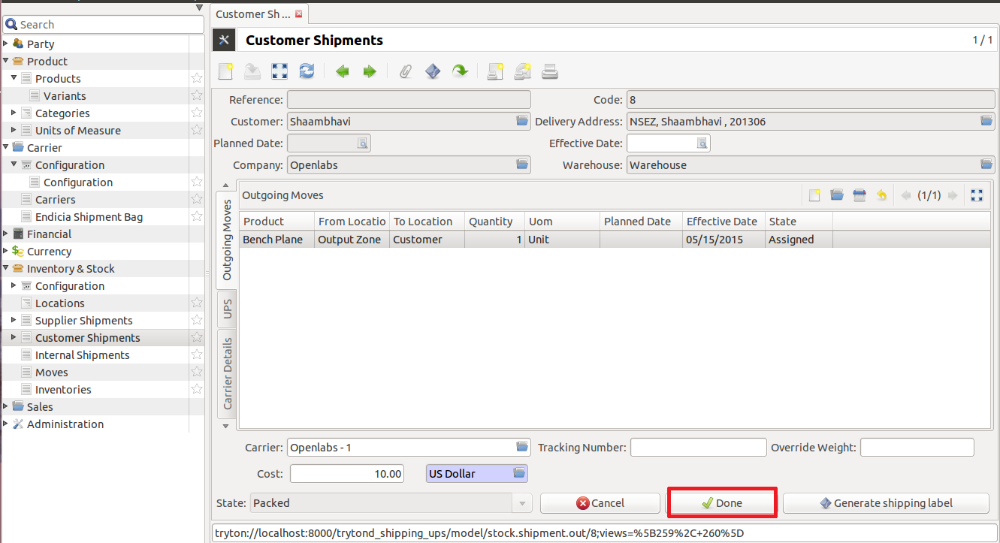

A new shipment is created.

.. _Generate Shipping Label`:

Generate Shipping Label
-----------------------

This documentation demonstrates how shipping label can be generated 
for each shipment.

Any shipment can be opened and on clicking ``Generate Shipping Label``, 
a new shipment label will be generated for the same.

Select any shipment and follow the steps below to generate a shipping label.

1. Select any shipment and click on `Generate Shipping Label.`

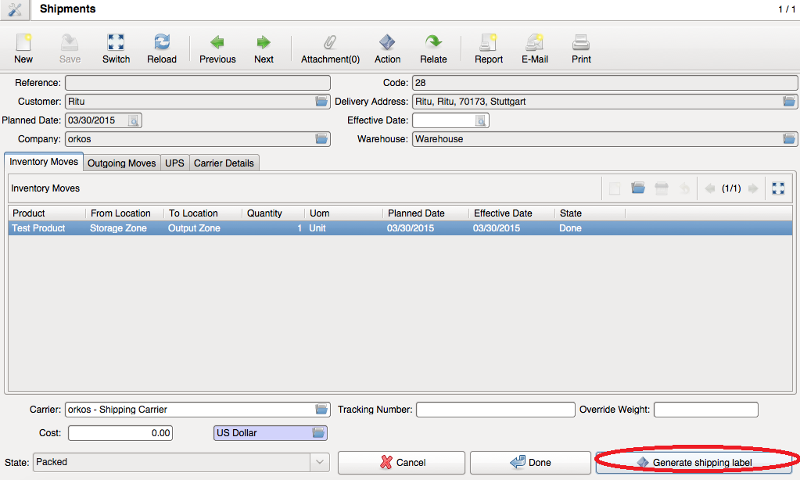

2. Select carrier on the next window which appears. Click on `Ok`.

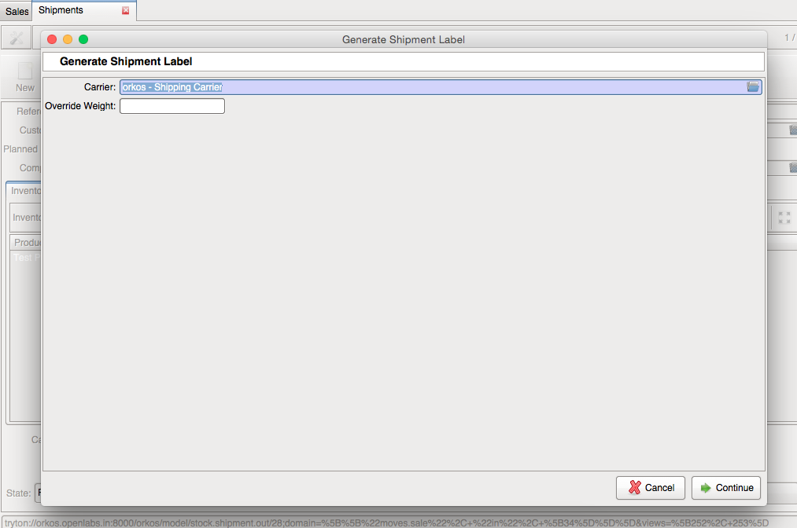

3. Select the UPS Configuration settings and click on `Continue`.

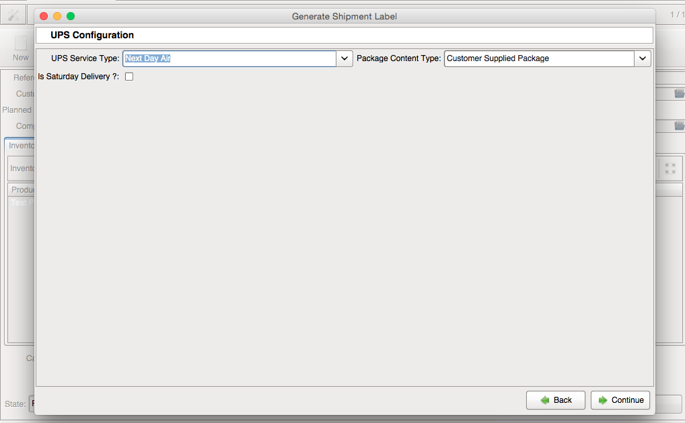

4. When the label is generated, the attachment will start showing a yellow
   star along with the number of attachments.

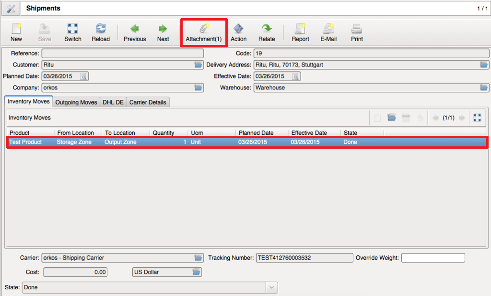

5. If the attachment is clicked, the label can be seen with the tracking 
   number.

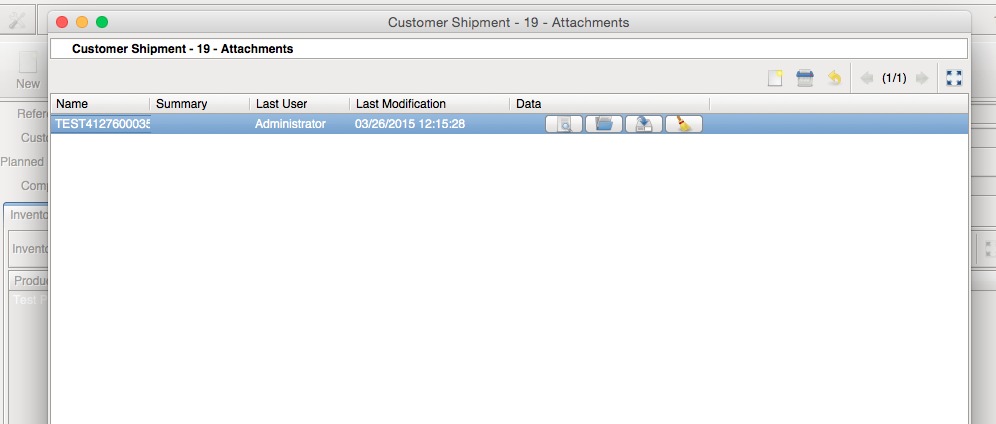

Once the lable is generated, you can hit "Done"
and complete the shipment. 
