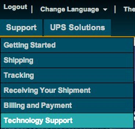
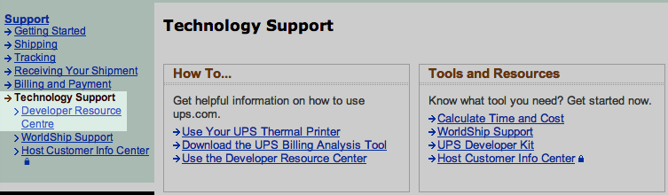
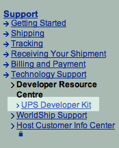
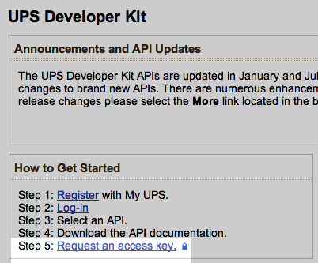
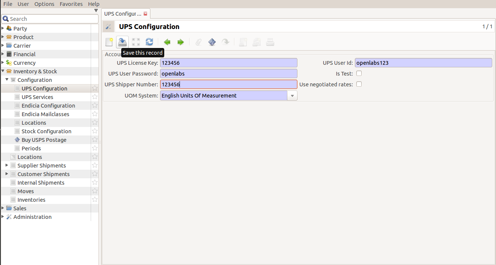

UPS Carrier Configuration
=========================

There are three steps to setting up UPS module for Tryton:

* `Setting up UPS Account`_
* `Obtaining XML Access Key from UPS Developer Resource Centre`_
* `Configuring UPS Settings in Tryton`_

.. _Setting up UPS Account:

UPS Account Setup
+++++++++++++++++++
.. note::

   Contact UPS Directly if there is any problem at this stage.

1. Go to `UPS Website <https://www.ups.com/>`_ to set up a new account.

2. On the website, select the location of your store and click
   on the arrow to go to the next page.

3. Click on `New User` at the top of the page.

4. Fill in the details including your User ID and Password.

5. Read the terms and conditions. Accept and click Next.

6. On completion of registration, account number will be generated. Note down
   all these details.

.. _Obtaining XML Access Key from UPS Developer Resource Centre:

Obtaining XML Key from Resource Centre
+++++++++++++++++++++++++++++++++++++++

.. note::

   This section assumes that a UPS account already exists.

To obtain XML Access Key:

1. Log into UPS account.

2. Click on `Support` in the top menu bar.

3. Click on the `Technology Support` from the drop down menu.

4. Select `Developer Resource Centre` from the Technology Support Menu.

5. From the menu, select the UPS Developer Kit.

6. Select ``Request Access Key``.

7. The key is generated and it will be sent over in email. Note down
   your XML key. 

8. Shipping Rates which are registered should be in the production mode.

.. _Configuring UPS Settings in Tryton:

Setting UPS Configuration in Tryton
++++++++++++++++++++++++++++++++++++

Before labels can be generated using this module, it has to be configured with 
UPS account details.

.. note::
   
   This section assumes that the UPS Account is already set up.

1. Click on ``Inventory & Stock`` >> ``Configuration``. 

2. Double click on ``UPS Configuration``. 

Double click on UPS Configuration. Fill in the following fields:

* **UPS License Key**: The unique license key generated during the Sign Up
process.
* **UPS User Password**: The user password for the UPS Account.
* **UPS Shipper Number**: The shipper number is generated for the seller.
* **UPS User ID**: The User ID for logging into your UPS account.

Click on ``Save this record``. 

UPS Carrier configuration has been successfully done.
